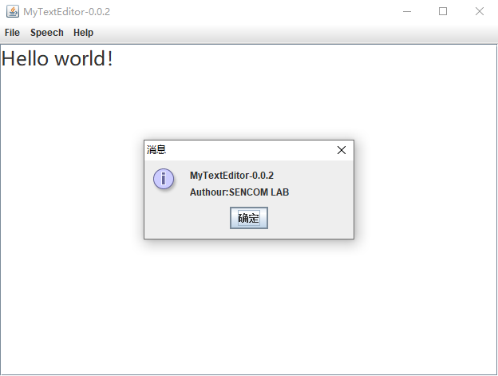

# MyTextEditor
**A Simple Text Editor write by Java**  

## how to building it?
* you may have to create a project by `Eclipse` then paste all the java source code`(in src/)`  
in the project which you create
* export all the jars `(in lib/)` to you project.
* add your aipspeech keys int the `src/Text2Speech.java`if you want the text2speech function.
```
//设置APPID/AK/SK
public static final String APP_ID = "";
public static final String API_KEY = "";
public static final String SECRET_KEY = "";
```  
## Notes
* the text2speech only support 1024byte text transform to speech at once. 
